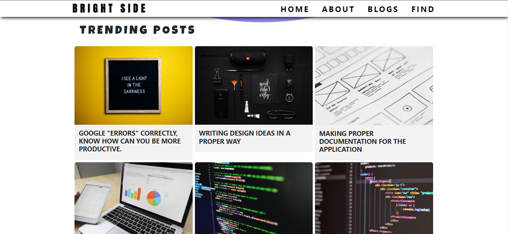
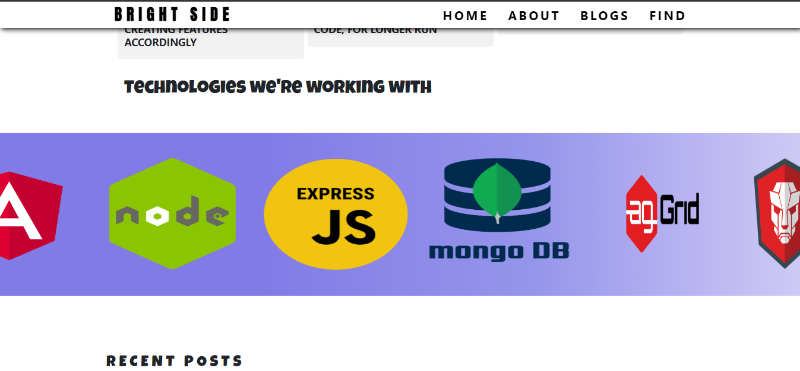
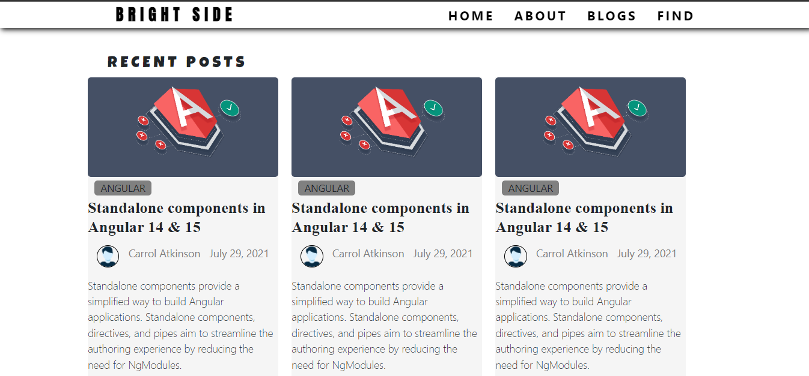
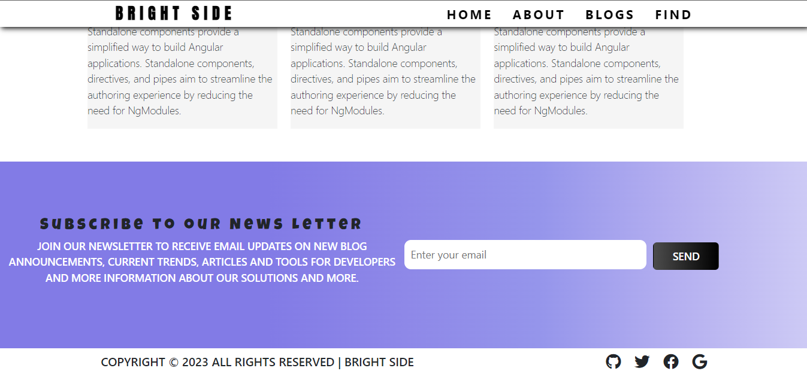

# Bright-Side

This is a blogging website where user can post daily updates with technology. 
In today's era it is impossible to remember everything, as technoglogy is growing everyday.
This website help user's and creator's to read and post their knowledge with everyone around the world.

## Technology Used

* **:electron: MongoDB**
* **:electron: Express**
* **:electron: NodeJS**
* **:electron: Angular**

### How to run this project

* Clone this github repository and open it in your code editor (vscode, sublime etc).

* Make sure you have **MongoDB** installed in your system so you can store the data

* Next, go inside **project** folder and type `ng serve` in the terminal to run the frontend application and go to the port which is provided by the terminal

* Now you need to run the backend part inorder to run the application fully.

* Go inside backend folder and type `nodemon index.js` which will run the API and you can now see the application running in the browser.

### Output 

#### Wanna Contribute?

* Clone the repository and fix the bugs, write test-cases, new feature anything that comes in your creative mind.

* Create a **pull-request** and we will review your code and **merge** it to the repository.

